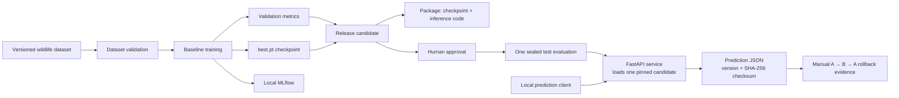

# Wildlife MLOps

Learn one object-detection lifecycle. The model detects buffalo, elephant,
rhino, and zebra.

## Architecture



## Setup

```sh
make bootstrap
make doctor
```

## Learn the data

```sh
make data-download
make data-validate
make data-visualize
```

Open `artifacts/data-preview/train.png`. Check that the boxes match the animals.

## Learn training

```sh
make predict-pretrained
make train-overfit
make train-smoke
make train-baseline
```

Each training command creates a new directory under `artifacts/`. Open its
`results.csv`, `run.json`, and `weights/best.pt`.

`train-overfit` uses a few images twice. Inspect whether its loss falls.
`train-smoke` proves the full training path works quickly. `train-baseline`
uses the whole training split.

## Track a run

Copy the example credentials once, then start local MLflow.

```sh
cp .env.example .env
make mlflow-up
make mlflow-smoke
make train-tracked
```

Open <http://127.0.0.1:5001>. A tracked run stores parameters, final metrics,
and its output files. Stop the services with `make mlflow-down` when finished.

## Version data

DVC tracks the dataset contents. Git tracks the small `data/raw.dvc` pointer.

```sh
uv run dvc status
```

The `run.json` file records the source archive checksum and DVC pointer checksum.

## Release, serve, and roll back

Keep MLflow running while creating candidates. A release command validates the
dataset, trains a fresh model, evaluates it on validation data, packages the
checkpoint with inference code, and registers it in MLflow.

### Create model A

```sh
make mlflow-up
make mlflow-smoke
make release-candidate
```

The last command prints a path such as
`artifacts/releases/candidate-abc123`. Copy that exact path into later commands
in place of `<candidate-a>`. Inspect `candidate.json` and `quality-report.json`
inside the candidate directory before approving it.

If MLflow registration fails after packaging succeeds, register the same
candidate without training again:

```sh
make register-candidate CANDIDATE=artifacts/releases/<candidate-a>
```

Approve the registered candidate, then evaluate its sealed test split once.

```sh
make approve-candidate CANDIDATE=artifacts/releases/<candidate-a> APPROVER="Your Name"
make evaluate-approved CANDIDATE=artifacts/releases/<candidate-a>
```

`evaluate-approved` writes one `test-evaluation.json` file and refuses to run a
second time for that candidate.

### Deploy model A

In terminal 1, start the API. It loads this one model at startup.

```sh
make serve CANDIDATE=artifacts/releases/<candidate-a>
```

In terminal 2, verify the selected identity and save a prediction. The output
path must not already exist.

```sh
curl http://127.0.0.1:8000/health
make send-prediction \
  IMAGE='data/raw/african-wildlife/images/val/4 (343).jpg' \
  OUTPUT=artifacts/model-a-prediction.json
```

Both responses include `candidate_id`, `model_version`, and `model_sha256`.
The checksum proves which exact model answered.

### Create and deploy model B

Stop model A in terminal 1 with `Ctrl-C`. Create B with the supplied four-epoch
configuration, then approve and evaluate it. Copy the newly printed candidate
path into `<candidate-b>`.

```sh
make release-candidate RELEASE_TRAIN_CONFIG=configs/train/baseline-extended.yaml
```

If B's MLflow registration fails, run this before approval; do not train B
again.

```sh
make register-candidate CANDIDATE=artifacts/releases/<candidate-b>
```

```sh
make approve-candidate CANDIDATE=artifacts/releases/<candidate-b> APPROVER="Your Name"
make evaluate-approved CANDIDATE=artifacts/releases/<candidate-b>
make serve CANDIDATE=artifacts/releases/<candidate-b>
```

In terminal 2, save B's response.

```sh
make send-prediction \
  IMAGE='data/raw/african-wildlife/images/val/4 (343).jpg' \
  OUTPUT=artifacts/model-b-prediction.json
```

### Roll back to model A

Stop B in terminal 1 with `Ctrl-C`, then serve A again. In terminal 2, save a
new A prediction and record the rollback evidence.

```sh
make serve CANDIDATE=artifacts/releases/<candidate-a>
```

```sh
make send-prediction \
  IMAGE='data/raw/african-wildlife/images/val/4 (343).jpg' \
  OUTPUT=artifacts/model-a-after-rollback.json
make record-rollback \
  FROM_CANDIDATE=artifacts/releases/<candidate-b> \
  TO_CANDIDATE=artifacts/releases/<candidate-a> \
  PREDICTION=artifacts/model-a-after-rollback.json \
  OUTPUT=artifacts/rollback-evidence.json
```

`record-rollback` checks that the saved response proves model A's checksum was
active again. Stop MLflow with `make mlflow-down` when you finish.

## Predict one image

```sh
make predict \
  MODEL=artifacts/baseline/<run>/weights/best.pt \
  IMAGE=data/raw/african-wildlife/images/val/<image>.jpg \
  OUTPUT=artifacts/prediction.json
```

The JSON result includes normalized boxes and the model checksum.
